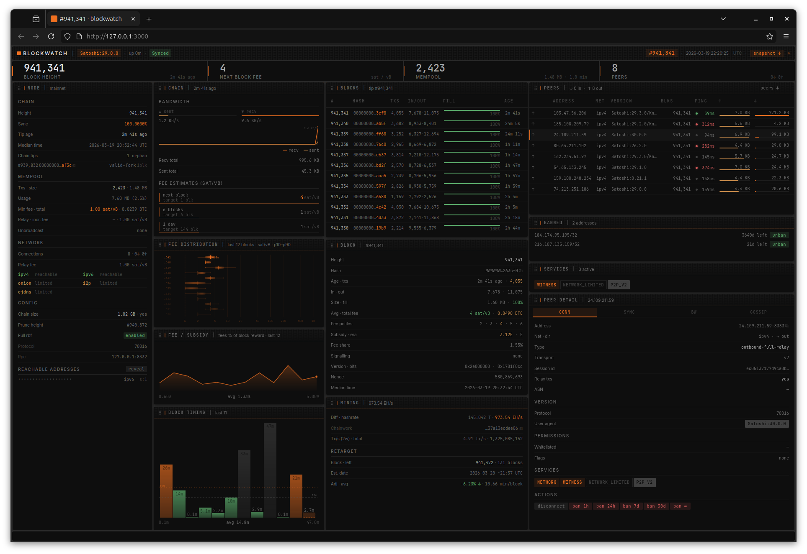
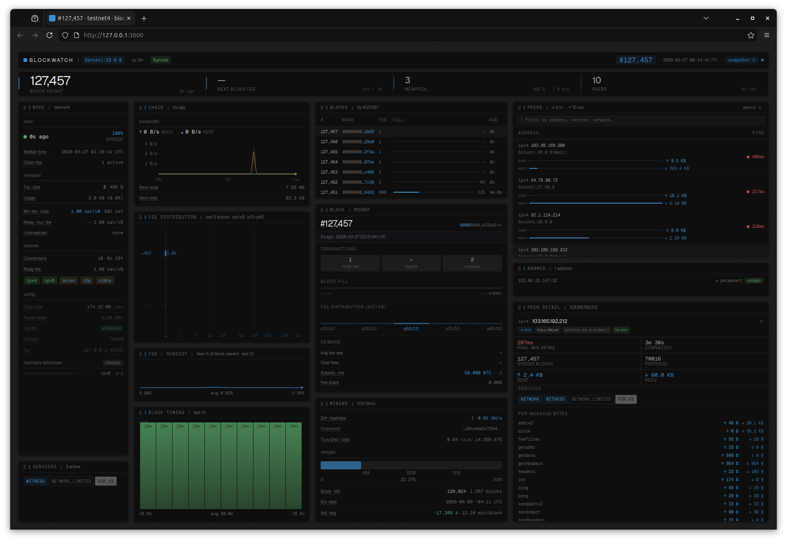
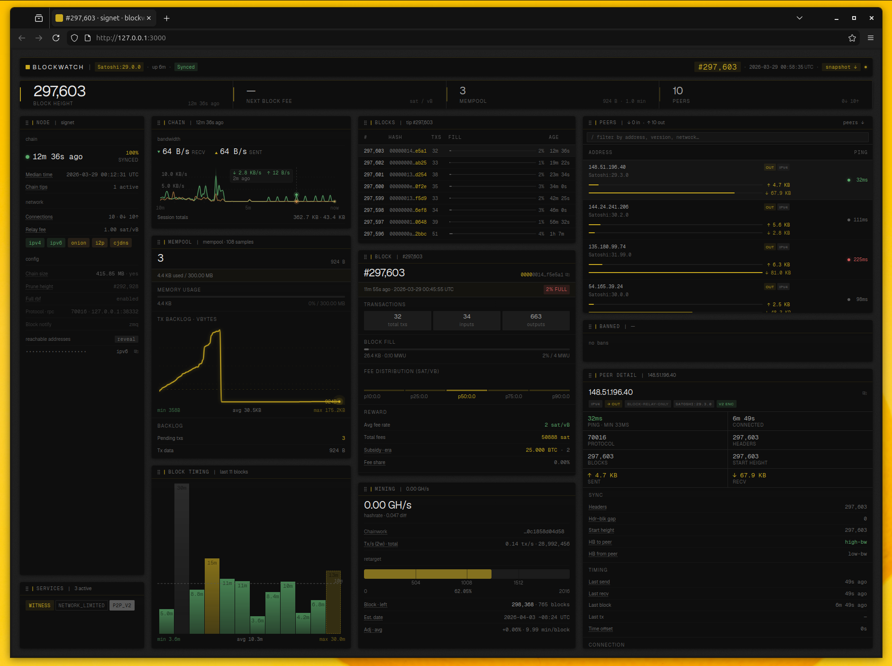
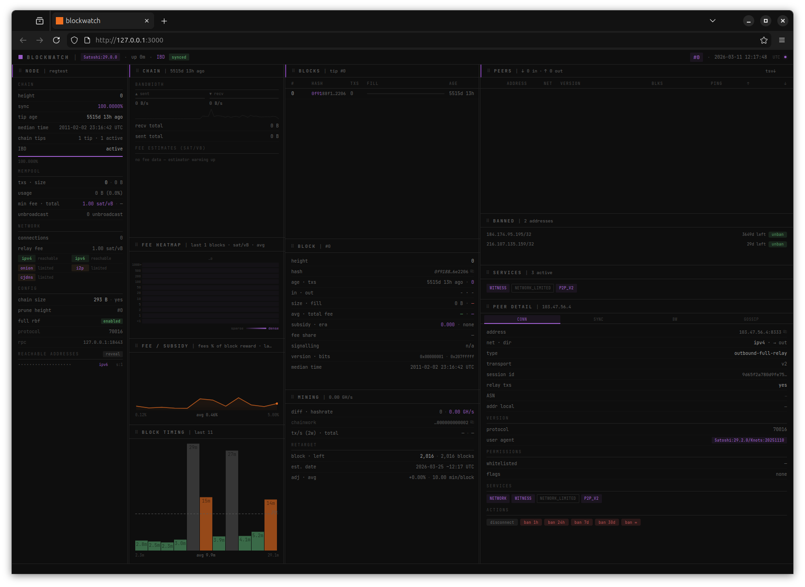

# BLOCKWATCH

A real-time Bitcoin node dashboard. Connects directly to your local Bitcoin Core node via RPC and displays live chain, mempool, peer, and network data in a clean, dense browser interface.

No dependencies beyond Node.js. No external APIs. Your node, your data.



---

## Features

- **Chain** — height, headers, sync progress, difficulty, hashrate, chainwork, chain tips / orphan detection
- **Blocks** — last 12 blocks with height, hash, tx count, size, age — hashes link to mempool.space (or your own instance)
- **Block detail** — per-block breakdown: fees, subsidy, era, fill %, miner signalling, BIP9 version bits
- **Fee / subsidy** — sparkline of fee revenue as a % of total block reward across recent blocks
- **Block timing** — bar chart of inter-block intervals, reveals mining rhythm
- **Block activity** — fee rate and total fee history across recent blocks
- **Softforks** — live deployment status for all active and pending BIP9 forks
- **Mempool** — tx count, size, fee rates, usage meter, min fee
- **Fee estimates** — next block / 6 blocks / 1 day / economy, colour-coded by urgency
- **Peers** — inbound/outbound, network type (IPv4/IPv6/onion/i2p), version, ping, latency, bandwidth, services; disconnect and ban controls
- **Network services** — local node service flags (NETWORK, WITNESS, COMPACT_FILTERS, P2P_V2 etc.)
- **Difficulty retarget** — next retarget block, blocks remaining, estimated date, estimated % change based on actual block velocity this period
- **IBD mode** — progress bar with real-time ETA computed from sync velocity across polls; polling slows to 30s and expensive RPC calls are skipped to avoid hammering a syncing node
- **Adaptive polling** — full data every 10s when synced; throttles to 30s during IBD
- **Network themes** — automatic accent colour per chain: orange (mainnet), blue (testnet4), gold (signet), purple (regtest)
- **Persistent layout** — panel order, column widths, and hidden state all persist across refreshes via localStorage

---

## Screenshots

| Mainnet | Testnet4 | Signet | Regtest |
|---|---|---|---|
|  |  |  |  |

> To add your own: run blockwatch against each network, take a full-browser screenshot at your preferred width, and save as `screenshot-mainnet.png`, `screenshot-testnet4.png`, `screenshot-signet.png`, and `screenshot-regtest.png` in the repo root.

---

## Requirements

- [Node.js](https://nodejs.org) v16 or later
- Bitcoin Core running locally with RPC enabled

---

## Setup

### 1. Enable RPC on your Bitcoin Core node

In `bitcoin.conf` (usually `~/.bitcoin/bitcoin.conf`):

```ini
server=1
```

That's it for most setups. Bitcoin Core generates a `.cookie` file automatically — blockwatch reads it without any extra configuration.

### Cookie auth vs rpcuser/rpcpassword

**Important:** if you have `rpcuser` and `rpcpassword` set in your `bitcoin.conf`, Bitcoin Core will **not** generate a cookie file — it's one or the other, not both. If blockwatch is prompting for credentials on every launch, this is why.

**Option A — cookie auth (recommended).** Remove `rpcuser` and `rpcpassword` from `bitcoin.conf`, restart bitcoind, and the `.cookie` file will appear automatically. blockwatch will find it with no configuration needed.

**Option B — explicit credentials.** Keep `rpcuser`/`rpcpassword` in your conf and pass them to blockwatch via environment variables:

```bash
BITCOIN_RPC_USER=youruser BITCOIN_RPC_PASS=yourpassword node server.js
```

If you switch from explicit credentials to cookie auth, restart bitcoind after removing them and verify the cookie appeared:

```bash
ls -la ~/.bitcoin/.cookie
```

### 2. Clone and run

```bash
git clone https://github.com/echo-of-ghost/blockwatch.git
cd blockwatch
node server.js
```

Then open [http://localhost:3000](http://localhost:3000) in your browser.

### 3. First launch

blockwatch looks for the cookie file automatically across all supported networks and platforms (in priority order):

1. `$BITCOIN_COOKIE_FILE` environment variable (if set, only this path is tried)
2. `~/.bitcoin/.cookie` — mainnet, Linux
3. `~/Library/Application Support/Bitcoin/.cookie` — mainnet, macOS
4. `~/snap/bitcoin-core/current/.bitcoin/.cookie` — mainnet, Snap
5. `~/.bitcoin/testnet4/.cookie` — testnet4
6. `~/.bitcoin/signet/.cookie` — signet
7. `~/.bitcoin/regtest/.cookie` — regtest

If multiple cookies exist (e.g. you're running signet and mainnet simultaneously), blockwatch picks the **most recently modified** one — i.e. the node that started last. To override this, set `BITCOIN_RPC_PORT` explicitly.

If no cookie is found at all, blockwatch prompts for RPC credentials in the terminal.

---

## Configuration

All configuration is via environment variables — no config file needed.

| Variable | Default | Description |
|---|---|---|
| `PORT` | `3000` | Port for the blockwatch web server |
| `HOST` | `127.0.0.1` | Interface for the blockwatch web server to bind to |
| `BITCOIN_RPC_HOST` | `127.0.0.1` | Bitcoin Core RPC host |
| `BITCOIN_RPC_PORT` | *(auto-detect)* | Bitcoin Core RPC port (8332 / 48332 / 38332 / 18443) |
| `BITCOIN_COOKIE_FILE` | *(auto-detect)* | Explicit path to `.cookie` file |
| `BITCOIN_RPC_USER` | *(from cookie)* | RPC username (overrides cookie) |
| `BITCOIN_RPC_PASS` | *(from cookie)* | RPC password (overrides cookie) |

### Examples

Cookie auto-detect (most common):
```bash
node server.js
```

Non-default data directory:
```bash
BITCOIN_COOKIE_FILE=/mnt/bitcoin/.bitcoin/.cookie node server.js
```

Explicit credentials:
```bash
BITCOIN_RPC_USER=alice BITCOIN_RPC_PASS=hunter2 node server.js
```

Force a specific network when running multiple nodes:
```bash
BITCOIN_RPC_PORT=38332 node server.js   # signet
BITCOIN_RPC_PORT=48332 node server.js   # testnet4
BITCOIN_RPC_PORT=18443 node server.js   # regtest
```

Listen on all interfaces (e.g. to access from another device on your LAN):
```bash
HOST=0.0.0.0 node server.js
```

> **Warning:** setting `HOST=0.0.0.0` exposes the dashboard on your network. blockwatch will print a warning at startup if this is detected. Ensure your firewall is configured appropriately.

---

## Health endpoint

blockwatch exposes a lightweight health endpoint at `/health` (also `/api/health`) for use with process monitors, uptime checkers, and systemd readiness probes.

```
GET http://localhost:3000/health
```

**Response — node reachable (`200 OK`):**
```json
{
  "ok": true,
  "height": 895210,
  "chain": "main",
  "synced": true,
  "ibd": false,
  "progress": 99.999,
  "headers": 895210,
  "ts": 1748000000000
}
```

**Response — bitcoind unreachable (`503 Service Unavailable`):**
```json
{
  "ok": false,
  "error": "getblockcount: connect ECONNREFUSED 127.0.0.1:8332",
  "ts": 1748000000000
}
```

The endpoint makes only two RPC calls (`getblockcount`, `getblockchaininfo`) and is intentionally separate from the full `/api/data` fetch. It is not rate-limited.

### systemd readiness check

Add to your service file to delay dependent units until blockwatch confirms bitcoind is up:

```ini
ExecStartPost=/usr/bin/curl -sf http://127.0.0.1:3000/health
```

---

## Running as a background service

To have blockwatch start automatically on boot, service files are included for both Linux and macOS.

### Linux (systemd)

```bash
sudo cp blockwatch@.service /etc/systemd/system/
sudo systemctl enable blockwatch@YOUR_USERNAME
sudo systemctl start blockwatch@YOUR_USERNAME
```

Replace `YOUR_USERNAME` with your actual username. The service runs as that user, so cookie auth works automatically. Edit `WorkingDirectory` in the service file if blockwatch is not installed at `~/blockwatch`.

### macOS (launchd)

Edit `com.blockwatch.dashboard.plist` and replace `YOUR_USERNAME` with your actual username and update the path if needed, then:

```bash
cp com.blockwatch.dashboard.plist ~/Library/LaunchAgents/
launchctl load ~/Library/LaunchAgents/com.blockwatch.dashboard.plist
```

Logs go to `/tmp/blockwatch.log` and `/tmp/blockwatch.error.log`.

To stop:
```bash
launchctl unload ~/Library/LaunchAgents/com.blockwatch.dashboard.plist
```

---

## Connecting to a remote node

blockwatch can connect to a Bitcoin Core node on another machine. The node's RPC port must be reachable from the machine running blockwatch.

```bash
BITCOIN_RPC_HOST=192.168.1.50 BITCOIN_RPC_PORT=8332 \
BITCOIN_RPC_USER=alice BITCOIN_RPC_PASS=hunter2 node server.js
```

**Security note:** Bitcoin Core's RPC is not encrypted. For remote access, use one of:
- A local network you trust (home LAN, Tailscale, WireGuard)
- An SSH tunnel: `ssh -L 8332:127.0.0.1:8332 user@remotehost`, then point blockwatch at `127.0.0.1:8332`

Do not expose the RPC port directly to the internet.

---

## Network themes

blockwatch automatically applies a colour theme based on the connected chain, so it's always clear which network you're looking at.

| Chain | Accent | RPC port |
|---|---|---|
| Mainnet | Orange | 8332 |
| Testnet4 | Blue | 48332 |
| Signet | Gold | 38332 |
| Regtest | Purple | 18443 |

The theme is applied instantly on data load — no configuration needed.

---

## Using your own mempool.space instance

Block hashes in the blocks table link to [mempool.space](https://mempool.space) for full transaction-level detail. These links are chain-aware — testnet4 and signet blocks link to the correct mempool.space subdirectory automatically.

To point links at your own self-hosted [mempool](https://github.com/mempool/mempool) instance, find the `mspaceUrl` function in `blockwatch.js` and update the base URL:

```js
// In blockwatch.js — mspaceUrl function
function mspaceUrl(hash, chain){
  const p={testnet4:'testnet4/',signet:'signet/'};
  const safeHash=/^[0-9a-fA-F]{64}$/.test(hash||'')?hash:'';
  return 'https://mempool.space/'+(p[chain]||'')+'block/'+safeHash;
  //      ↑ replace with your instance, e.g. 'http://192.168.1.50:8080/'
}
```

If your instance only serves one network, you can simplify the path logic too.

---

## Interface

### Panels

All panels are resizable by dragging the handles between them. Panels can also be dragged by their header to reorder them within or across columns. Hide a panel by clicking `×` on its header, or right-clicking the header for a context menu. Hidden panels can be restored from the status bar at the bottom.

Panel order, column widths, and hidden state all persist automatically across page refreshes via localStorage.

### Peer controls

Click any row in the peers table to inspect that peer's full detail — protocol version, services, latency, sync height, bandwidth, and gossip stats. From the detail panel you can disconnect a peer or ban them for 1h / 24h / 7d / 30d / permanently. Ban list is shown in the bans panel and entries can be removed from there.

### Keyboard shortcuts

| Key | Action |
|---|---|
| `R` | Force a full refresh |

### Status bar

The bottom status bar shows:
- Live connection dot (pulses green when synced, red on error)
- Staleness indicator — shows time since last successful fetch if data is stale
- Any node warnings from `getblockchaininfo`
- Hidden panel restore pills

---

## Project structure

```
blockwatch/
  server.js                      — Node.js HTTP server, Bitcoin Core RPC client
  index.html                     — Frontend markup
  blockwatch.js                  — Frontend logic
  blockwatch.css                 — Styles
  blockwatch@.service            — systemd service file (Linux)
  com.blockwatch.dashboard.plist — launchd service file (macOS)
  CHANGELOG.md
  README.md
  LICENSE
```

No `npm install` required. No `node_modules`. The server uses only Node.js built-ins (`http`, `fs`, `path`, `os`, `readline`).

---

## Font

blockwatch uses [JetBrains Mono](https://www.jetbrains.com/lp/mono/) loaded via Google Fonts. No local font files are required.

---

## RPC calls made

On each full refresh (every 10s when synced, 30s during IBD):

- `getblockchaininfo`
- `getnetworkinfo`
- `getmempoolinfo`
- `getpeerinfo`
- `getnettotals`
- `uptime`
- `getdeploymentinfo`
- `getchaintxstats`
- `getchaintips`
- `getblockhash` × 12 (× 8 during IBD)
- `getblockheader` × 12 (× 8 during IBD)
- `getblockstats` × 12 *(skipped during IBD)*
- `estimatesmartfee` × 4 *(skipped during IBD)*

The `/api/data` endpoint is rate-limited to 5 requests per second to protect bitcoind from abusive polling. Under normal operation (one poll every 10s) this limit is never reached.

If a second browser tab (or a slow poll overlapping the next interval) hits the server while a fetch is already in flight, the in-flight promise is reused — no duplicate RPC calls are made.

---

## Notes

- **IBD (Initial Block Download)** — During sync, blockwatch automatically reduces polling to every 30s and skips `getblockstats` and fee estimates to avoid adding load to a node already running at capacity. Polling returns to normal automatically once IBD completes.
- **Cookie vs credentials** — Bitcoin Core will not create a `.cookie` file if `rpcuser`/`rpcpassword` are set in `bitcoin.conf`. If blockwatch is prompting for credentials on every launch, remove those lines from your conf and restart bitcoind.
- **Fee estimates** — `estimatesmartfee` requires a warmed-up fee estimator. On a freshly started or IBD node, fee estimates will show a "warming up" message rather than stale or synthetic data.
- **Onion / I2P peers** — Peer addresses are displayed as plain text. Only clearnet addresses link to mempool.space since onion/i2p addresses are not resolvable there.
- **Difficulty retarget estimate** — The estimated difficulty change is computed from actual measured block times during the current 2016-block period, not from the theoretical 10-minute target. The history resets at each new period.
- **getdeploymentinfo** — Available in Bitcoin Core v24+. On older nodes this call returns null and the softforks panel renders nothing rather than erroring.
- **Security** — The `/api/rpc` endpoint (used for peer disconnect/ban actions) is restricted to loopback connections only. The web server enforces an `Origin` header check so only localhost origins can make API calls. Every response includes a `Content-Security-Policy` header and a `Permissions-Policy` header that explicitly disables camera, microphone, geolocation, and payment APIs. If `HOST` is set to anything other than `127.0.0.1`, blockwatch prints a warning at startup.
- **Connection errors** — If bitcoind is unreachable on first load, the connecting overlay is shown. After a successful first load, any subsequent connection errors surface in the status bar only — the dashboard stays visible with the last good data.

---

## License

GNU GENERAL PUBLIC LICENSE