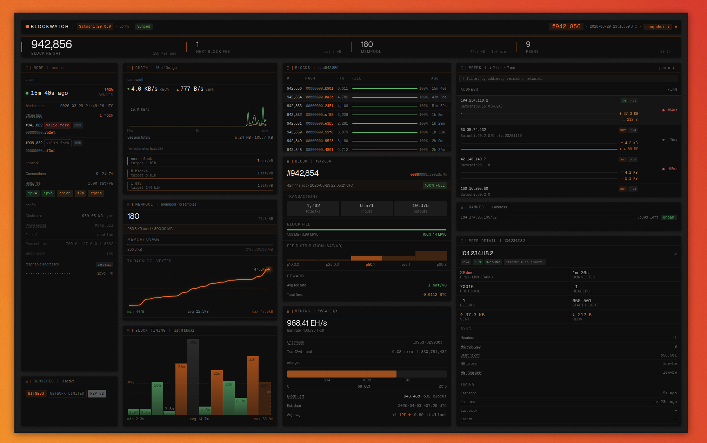
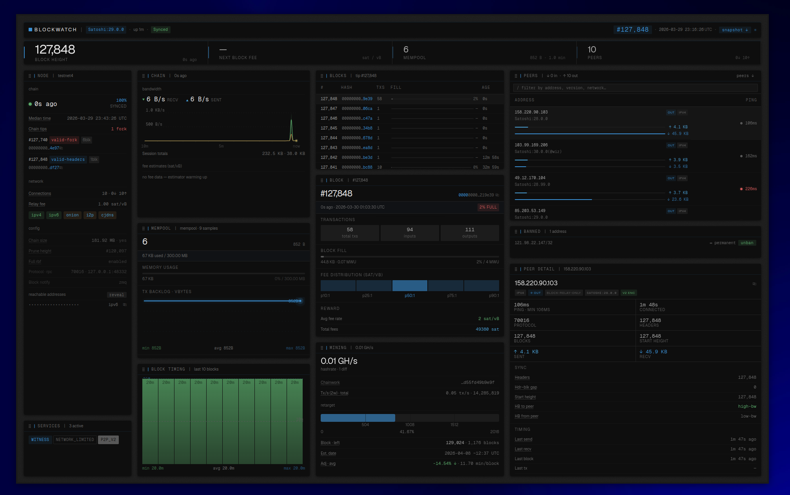
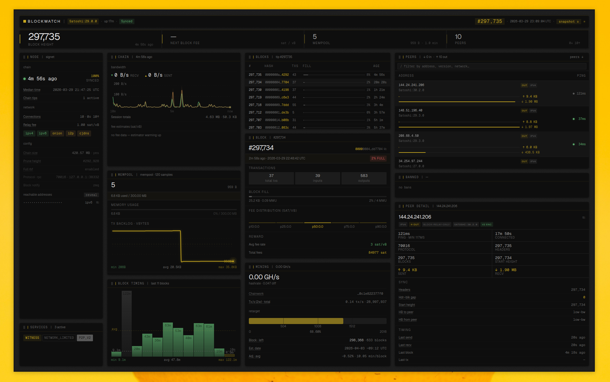
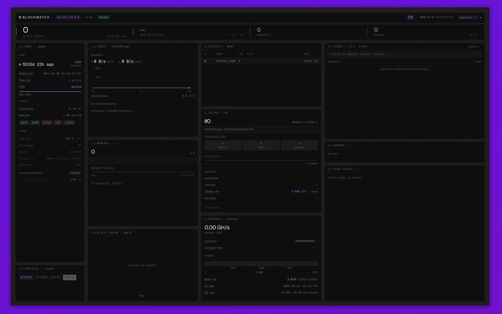

# BLOCKWATCH

A real-time Bitcoin node dashboard. Connects directly to your local Bitcoin Core node via RPC and displays live chain, mempool, peer, and network data in a clean, dense desktop interface.

Uses Bitcoin Core's native ZMQ for real-time block notifications, with a 10-second RPC poll always running as a safety net. No external APIs. Your node, your data.



---

## Features

- **Chain** — height, headers, sync progress, difficulty, hashrate, chainwork, chain tips / orphan detection
- **Blocks** — last 16 blocks (8 during IBD) with height, hash, tx count, size, weight, age — hashes link to mempool.space (or your own instance)
- **Block detail** — per-block breakdown: fees, subsidy, era, fill %, feerate, miner version bits
- **Fee / subsidy** — sparkline of fee revenue as a % of total block reward across recent blocks
- **Block timing** — bar chart of inter-block intervals with gradient area fill, reveals mining rhythm
- **Block activity** — fee rate and total fee history across recent blocks
- **Softforks** — live deployment status for all active and pending BIP9 forks (requires Bitcoin Core v24+)
- **Mempool** — tx count, size, fee rates, usage meter, min relay fee, updated every 5s
- **Next block fee** — sat/vB estimate shown in the hero strip; skipped during IBD
- **Peers** — inbound/outbound, network type (IPv4/IPv6/onion/i2p), version, ping, latency, bandwidth, services; disconnect and ban controls
- **Network services** — local node service flags (NETWORK, WITNESS, COMPACT_FILTERS, P2P_V2 etc.)
- **Difficulty retarget** — next retarget block, blocks remaining, estimated date, estimated % change based on actual block velocity this period
- **IBD mode** — progress bar with real-time ETA computed from sync velocity; fee estimates disabled, only 8 blocks shown to reduce load
- **Real-time block updates** — ZMQ subscriptions to Bitcoin Core for instant block arrival (< 1s latency); falls back to 10s polling if unavailable
- **New block audio** — optional block chime (toggle badge in titlebar, persisted across sessions)
- **Bandwidth chart** — 10-minute history at 5-second resolution (120 samples), updated continuously
- **Network themes** — automatic accent colour per chain: orange (mainnet), blue (testnet4), gold (signet), purple (regtest)
- **Persistent layout** — panel order, column widths, and hidden state all persist across sessions via localStorage

---

## Screenshots

| Mainnet | Testnet4 | Signet | Regtest |
|---|---|---|---|
|  |  |  |  |


---

## Desktop App (AppImage)

blockwatch ships as a self-contained Linux desktop application. Download the latest `.AppImage` from the [releases page](https://github.com/echo-of-ghost/blockwatch/releases), make it executable, and run it — no installation required.

```bash
chmod +x Blockwatch-2.5.0.AppImage
./Blockwatch-2.5.0.AppImage
```

The app embeds a Node.js server and opens directly to the dashboard. All configuration (cookie auth, ZMQ, environment variables) works the same as described below.

To build the AppImage yourself (requires Node.js 22 or newer — see Requirements):
```bash
npm ci
npm run dist        # outputs to dist/
```

To run in dev mode without packaging:
```bash
npm run app
```

> **Note:** AppImage icons require system integration (e.g. [AppImageLauncher](https://github.com/TheAssassin/AppImageLauncher)) to show in the GNOME/KDE taskbar on Wayland.

### Verifying the signature

Each release includes a detached GPG signature (`.asc`). Import the key matching
the release you are verifying.

| Releases | Key file | Fingerprint |
|---|---|---|
| 2.3.0 and later | `pubkey.asc` | `5757 5740 8588 8291 E05C  BEE9 F37F EFF1 9EF2 56B2` |
| 2.2.0 – 2.2.3 | `pubkey-2026-03-29.asc` | `0833 749B 80D9 C23C D361  0C97 0B21 FC31 5D77 0B0B` |

**1. Import the key** for the release you are verifying (first time only):
```bash
gpg --import pubkey.asc
```

**2. Confirm the fingerprint matches the table above** before trusting it:
```bash
gpg --fingerprint maplehodl@protonmail.com
```

**3. Verify:**
```bash
gpg --verify Blockwatch-2.5.0.AppImage.asc Blockwatch-2.5.0.AppImage
```

A good signature looks like:
```
gpg: Good signature from "Maple <maplehodl@protonmail.com>"
```

Any `BAD signature` result means the file has been tampered with — do not run it.

You will also see a warning that the key is not certified with a trusted
signature. That is expected: it means you have not personally signed the key,
not that anything is wrong with the download.

#### Signing keys

Releases from 2.3.0 onward are signed with `F37FEFF19EF256B2`, which expires
2028-09-03.

The previous key `0B21FC315D770B0B` is no longer used for signing. It is kept as
`pubkey-2026-03-29.asc` so that releases 2.2.0 through 2.2.3 remain verifiable.

---

## Requirements

- [Node.js](https://nodejs.org) v18 or later to run `server.js`
- [Node.js](https://nodejs.org) **v22 or later to build** the AppImage or run the
  Electron app from source. Electron's installer requires it, and on Node 18 the
  install completes without ever downloading the Electron binary.
- Bitcoin Core running locally with RPC enabled
- (Optional) ZeroMQ support in Bitcoin Core for real-time block updates

---

## Setup

### 1. Enable RPC on your Bitcoin Core node

In `bitcoin.conf` (usually `~/.bitcoin/bitcoin.conf`):

```ini
server=1
```

That's it for most setups. Bitcoin Core generates a `.cookie` file automatically — blockwatch reads it without any extra configuration.

### Cookie auth vs rpcuser/rpcpassword

**Important:** if you have `rpcuser` and `rpcpassword` set in your `bitcoin.conf`, Bitcoin Core will **not** generate a cookie file — it's one or the other, not both. If blockwatch is prompting for credentials on every launch, this is why.

**Option A — cookie auth (recommended).** Remove `rpcuser` and `rpcpassword` from `bitcoin.conf`, restart bitcoind, and the `.cookie` file will appear automatically. blockwatch will find it with no configuration needed.

**Option B — explicit credentials.** Keep `rpcuser`/`rpcpassword` in your conf and pass them to blockwatch via environment variables:

```bash
BITCOIN_RPC_USER=youruser BITCOIN_RPC_PASS=yourpassword npm run app
```

If you switch from explicit credentials to cookie auth, restart bitcoind after removing them and verify the cookie appeared:

```bash
ls -la ~/.bitcoin/.cookie
```

### 2. Clone, install, and launch

```bash
git clone https://github.com/echo-of-ghost/blockwatch.git
cd blockwatch
npm ci
npm run app
```

`npm ci` installs exactly the versions recorded in `package-lock.json`. (If you skip it, blockwatch still works but relies on the 10-second poll instead of ZMQ for block updates.)

### 3. Enable ZMQ for real-time block updates (optional but highly recommended)

ZMQ reduces RPC load by ~14x and gives you < 1 second block notification latency instead of polling delays.

Add to `bitcoin.conf` (usually `~/.bitcoin/bitcoin.conf`):

```ini
zmqpubhashblock=tcp://127.0.0.1:28332
zmqpubhashtx=tcp://127.0.0.1:28333
```

Restart bitcoind:

```bash
bitcoin-cli stop
bitcoind -daemon
```

blockwatch connects to the ZMQ endpoint on startup. A ZMQ connection cannot fail loudly (the socket retries in the background forever), so the node panel's `zmq` / `polling` indicator and `/api/health`'s `blockSource` report which path is actually delivering blocks: `zmq` once the socket has connected or a block has arrived, `polling` otherwise.

If you don't set up ZMQ, the 10-second poll keeps everything working — blocks just show up a few seconds later.

### 4. First launch

blockwatch looks for the cookie file automatically across all supported networks and platforms (in priority order):

1. `$BITCOIN_COOKIE_FILE` environment variable (if set, only this path is tried)
2. `~/.bitcoin/.cookie` — mainnet, Linux
3. `~/Library/Application Support/Bitcoin/.cookie` — mainnet, macOS
4. `~/snap/bitcoin-core/current/.bitcoin/.cookie` — mainnet, Snap
5. `~/.bitcoin/testnet4/.cookie` — testnet4
6. `~/.bitcoin/signet/.cookie` — signet
7. `~/.bitcoin/regtest/.cookie` — regtest

If multiple cookies exist (e.g. you're running signet and mainnet simultaneously), blockwatch picks the **most recently modified** one — i.e. the node that started last. To override this, set `BITCOIN_RPC_PORT` explicitly.

If no cookie is found at all, blockwatch prompts for RPC credentials in the terminal.

---

## Configuration

All configuration is via environment variables — no config file needed.

### Bitcoin RPC

| Variable | Default | Description |
|---|---|---|
| `BITCOIN_RPC_HOST` | `127.0.0.1` | Bitcoin Core RPC host |
| `BITCOIN_RPC_PORT` | *(auto-detect)* | Bitcoin Core RPC port (8332 / 48332 / 38332 / 18443) |
| `BITCOIN_COOKIE_FILE` | *(auto-detect)* | Explicit path to `.cookie` file |
| `BITCOIN_RPC_USER` | *(from cookie)* | RPC username (overrides cookie) |
| `BITCOIN_RPC_PASS` | *(from cookie)* | RPC password (overrides cookie) |

### ZMQ (optional)

| Variable | Default | Description |
|---|---|---|
| `ZMQ_HOST` | `127.0.0.1` | ZMQ publisher host (must match `zmqpubhashblock` bind address in bitcoin.conf) |
| `ZMQ_PORT` | `28332` | ZMQ publisher port (must match bitcoin.conf) |

### Remote mode

By default the server binds `127.0.0.1` only and refuses to start with a non-loopback `HOST`. To serve the dashboard to other machines, enable remote mode, which binds `0.0.0.0` and requires HTTP basic auth on every request:

| Variable | Description |
|---|---|
| `BLOCKWATCH_REMOTE=1` | Enable remote mode (basic auth, binds all interfaces) |
| `BLOCKWATCH_USER` / `BLOCKWATCH_PASS` | Dashboard credentials (prompted if unset and stdin is a terminal) |

Traffic is plain HTTP. Put it behind a TLS reverse proxy or a VPN/SSH tunnel rather than exposing it to the internet. Requests whose `Origin` does not match the `Host` they arrived on are rejected, so a cross-site page cannot drive peer actions with your cached credentials.

### Examples

**Default (cookie auto-detect, ZMQ auto-connect):**
```bash
npm run app
```

**Non-default Bitcoin data directory:**
```bash
BITCOIN_COOKIE_FILE=/mnt/bitcoin/.bitcoin/.cookie npm run app
```

**Explicit RPC credentials:**
```bash
BITCOIN_RPC_USER=alice BITCOIN_RPC_PASS=hunter2 npm run app
```

**Custom ZMQ endpoint** (if not on localhost or non-standard port):
```bash
ZMQ_HOST=192.168.1.50 ZMQ_PORT=28332 npm run app
```

**Force a specific network** (when running multiple nodes):
```bash
BITCOIN_RPC_PORT=38332 npm run app   # signet
BITCOIN_RPC_PORT=48332 npm run app   # testnet4
BITCOIN_RPC_PORT=18443 npm run app   # regtest
```

---

## Connecting to a remote node

blockwatch can connect to a Bitcoin Core node on another machine. The node's RPC port must be reachable from the machine running blockwatch.

```bash
BITCOIN_RPC_HOST=192.168.1.50 BITCOIN_RPC_PORT=8332 \
BITCOIN_RPC_USER=alice BITCOIN_RPC_PASS=hunter2 npm run app
```

**Security note:** Bitcoin Core's RPC is not encrypted. For remote access, use one of:
- A local network you trust (home LAN, Tailscale, WireGuard)
- An SSH tunnel: `ssh -L 8332:127.0.0.1:8332 user@remotehost`, then point blockwatch at `127.0.0.1:8332`

Do not expose the RPC port directly to the internet.

---

## Network themes

blockwatch automatically applies a colour theme based on the connected chain, so it's always clear which network you're looking at.

| Chain | Accent | RPC port |
|---|---|---|
| Mainnet | Orange | 8332 |
| Testnet4 | Blue | 48332 |
| Signet | Gold | 38332 |
| Regtest | Purple | 18443 |

The theme is applied instantly on data load — no configuration needed.

---

## Using your own mempool.space instance

Block hashes in the blocks table link to [mempool.space](https://mempool.space) for full transaction-level detail. These links are chain-aware — testnet4 and signet blocks link to the correct mempool.space subdirectory automatically.

To point links at your own self-hosted [mempool](https://github.com/mempool/mempool) instance, find the `mspaceUrl` function in `client/shared.js` and update the base URL:

```js
// In client/shared.js — mspaceUrl function
function mspaceUrl(hash, chain){
  const p={testnet4:'testnet4/',signet:'signet/'};
  const safeHash=/^[0-9a-fA-F]{64}$/.test(hash||'')?hash:'';
  return 'https://mempool.space/'+(p[chain]||'')+'block/'+safeHash;
  //      ↑ replace with your instance, e.g. 'http://192.168.1.50:8080/'
}
```

If your instance only serves one network, you can simplify the path logic too.

---

## Interface

### Panels

All panels are resizable by dragging the handles between them. Panels can also be dragged by their header to reorder them within or across columns. Hide a panel by right-clicking its header for a context menu. Hidden panels can be restored via the restore chips that appear in the titlebar.

Panel order, column widths, and hidden state all persist automatically across sessions via localStorage.

### Terminal

Press **Ctrl+`** (or **Cmd+`** on macOS) to open the built-in terminal drawer.

Type any bitcoin-cli RPC method and arguments directly:

```
getblockchaininfo
getmempoolinfo
gettxoutsetinfo
getpeerinfo
estimatesmartfee 1
getblock <hash> 2
```

Arguments are parsed the same as bitcoin-cli — strings, numbers, and JSON all work. Use ↑/↓ to navigate history. Output is syntax-highlighted JSON.

RPC calls are routed through the Electron main process. Credentials are never exposed to the renderer.

### New block audio

A subtle chime plays when a new block arrives. Toggle it with the **♪** badge in the top-right titlebar. The preference is persisted in localStorage across sessions. Audio uses a bundled `.ogg` file — no network request.

### Peer controls

Click any row in the peers table to inspect that peer's full detail — protocol version, services, latency, sync height, bandwidth, and gossip stats. From the detail panel you can disconnect a peer or ban them for 1h / 24h / 7d / 30d / permanently. Ban list is shown in the bans panel and entries can be removed from there.

### Status bar

The bottom status bar shows:
- Live connection dot (pulses green when synced, red on error)
- Staleness indicator — shows time since last successful fetch if data is stale
- Any node warnings from `getblockchaininfo`
- Hidden panel restore chips (appear in titlebar when panels are hidden)

---

## Project structure

```
blockwatch/
  server.js                      — Node.js HTTP server, Bitcoin Core RPC client, ZMQ subscriber
  client/
    boot.js                      — Initialization, event wiring, polling start
    network.js                   — EventSource listener, bandwidth tracking, data export
    terminal.js                  — In-app terminal drawer (Electron only)
    *.js                         — Panel rendering modules
  electron/
    main.js                      — Electron main process, window creation, terminal IPC
    preload.js                   — Context bridge: terminal RPC, platform class, toggle relay
  assets/
    icon.png                     — App icon (1024×1024)
    block.ogg                    — New block chime audio
  index.html                     — Frontend markup
  blockwatch.css                 — Styles
  package.json                   — Dependencies and electron-builder config
  CHANGELOG.md
  README.md
  LICENSE
```

Node.js built-ins handle HTTP, RPC, and data. ZMQ support is optional via the `zeromq` npm package for real-time block notifications. Without it, blockwatch falls back to polling automatically.

---

## Font

blockwatch uses [Geist](https://vercel.com/font/geist) for a clean, modern monospace look. Both `Geist` and `Geist Mono` are bundled as local `.woff2` files — no external requests, no network dependency.

---

## Update schedule

Data updates on multiple timers and events:

**Block Event (ZMQ hashblock — ~every 10 minutes):**
```
getblockchaininfo
getblockhash
getblockheader
getblockstats
getchaintxstats        (2016-block window: tx rate, avg block time)
getchaintxstats        (current difficulty period: retarget estimate)
getmempoolinfo
```
Total: **7 calls per block** (more after a gap or reorg — one header/stats pair per missing block, capped at 24)

**Tip watcher (every 10 seconds):**
```
getblockchaininfo      (chain switch, header sync progress, new-block safety net)
```

**Fast Refresh (every 5 seconds):**
```
getnettotals           (bandwidth history)
getmempoolinfo         (mempool size/fee rates)
```
Total: **2 calls × 12/min = 24 calls/min**

**Sparse Refresh (every 60 seconds):**
```
getpeerinfo            (peer list, bandwidth)
getnetworkinfo         (network stats, warnings)
getchaintips           (orphan/alternate chains)
uptime                 (node uptime)
estimatesmartfee [1]   (next block fee, skipped during IBD)
```
Total: **4 calls always + 1 fee call = 5 calls/min** (4 calls/min during IBD)

**Deployment Refresh (every 5 minutes):**
```
getdeploymentinfo      (softfork status)
```
Total: **0.2 calls/min**

### RPC Load Comparison

| Scenario | Calls/min | Notes |
|----------|-----------|-------|
| **With ZMQ** | ~30 | 0.5 block + 24 fast + 5 sparse + 0.2 deployment |
| **Without ZMQ (polling)** | ~180 | Full snapshot every 10s |
| **Reduction** | **6x** | Significant improvement with ZMQ |

The `/api/data` endpoint serves cached state — no additional RPC calls made.

---

## Notes

- **IBD (Initial Block Download)** — During sync, blockwatch automatically limits the blocks table to 8 entries (vs 16 when synced) and skips fee estimates to reduce RPC load on a node already running at capacity. ZMQ block events continue to fire normally. Everything returns to normal automatically once IBD completes.
- **ZMQ configuration** — ZMQ is optional. If enabled in `bitcoin.conf`, blockwatch uses it for sub-second block notifications. A 10-second `getblockchaininfo` poll always runs alongside it: it catches node/chain switches, keeps header-sync progress fresh, and picks up new blocks whenever ZMQ is not delivering (not configured, wrong host, or disconnected).
- **Reorgs** — Block updates are keyed on `bestblockhash`, not height. A reorg (same height or deeper) replaces the orphaned blocks in the table, re-renders the block detail if it was showing one of them, and logs a `[reorg]` line on the server.
- **Cookie vs credentials** — Bitcoin Core will not create a `.cookie` file if `rpcuser`/`rpcpassword` are set in `bitcoin.conf`. If blockwatch is prompting for credentials on every launch, remove those lines from your conf and restart bitcoind.
- **Fee estimates** — `estimatesmartfee [1]` is called during the 60s sparse refresh, but only when not in IBD mode. On a freshly started node, fee estimates will show `—` rather than stale data. Estimates update every minute once warmed up.
- **New block age** — When a new block arrives, the displayed age will be 5–10 seconds rather than 0s. This is expected: the `time` field is set by the miner, and several seconds elapse during P2P propagation, bitcoind processing, ZMQ delivery, and RPC round-trips before the dashboard renders it. The tip age counter ticks live every second between block events.
- **Onion / I2P peers** — Peer addresses are displayed as plain text. Only clearnet addresses link to mempool.space since onion/i2p addresses are not resolvable there.
- **Difficulty retarget estimate** — The estimated change is computed the way Bitcoin Core does it: the time from the first block of the current 2016-block period to the tip is projected across 2015 intervals, compared with two weeks, and clamped to ¼–4×. It shows `—` on the first block of a period and is naturally noisy early in the period.
- **getdeploymentinfo** — Available in Bitcoin Core v24+. On older nodes this call returns null and the softforks panel renders nothing rather than erroring. Updates every 5 minutes.
- **Mempool updates** — The mempool panel updates every 5 seconds (via fast refresh). This gives real-time visibility into tx count, size, and fee rates without the latency of a full sparse refresh.
- **Bandwidth history** — The network bandwidth chart maintains a 10-minute rolling window at 5-second resolution (120 samples).
- **Security** — In local mode the server binds loopback only and rejects requests whose `Host` header is not `localhost` / `127.0.0.1` (DNS-rebinding protection). In both modes an `Origin` header must match `Host`, and `/api/rpc` (peer disconnect/ban, ban list, UTXO set scan) only accepts `application/json` bodies, a fixed method allowlist, and per-method parameter shapes (ban targets must be IP literals or subnets no wider than /16 or /32; one UTXO scan at a time). Every response includes a `Content-Security-Policy` header and a `Permissions-Policy` header that explicitly disables camera, microphone, geolocation, and payment APIs. The in-app terminal has no method restrictions by design — like `bitcoin-cli`, it can run wallet commands.
- **Connection errors** — If bitcoind is unreachable on first load, the connecting overlay is shown. After a successful first load, any subsequent connection errors surface in the status bar only — the dashboard stays visible with the last good data. The stale indicator shows how long data has been stale.

---

## License

GNU GENERAL PUBLIC LICENSE
